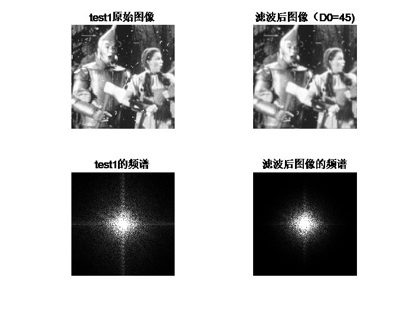
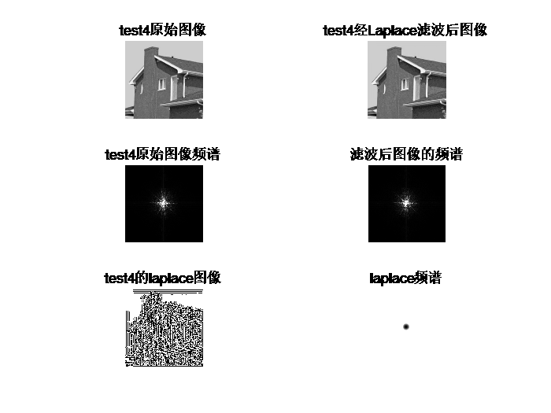

**数字图像处理第五次作业**

姓名：孔恒

班级：自动化64

学号：2160504095

1.  **频域低通滤波器：设计低通滤波器包括 butterworth and Gaussian
    (选择合适的半径，计算功率谱比),平滑测试图像test1和2;分析各自优缺点；**

**(1).巴特沃斯低通滤波器：**

截止频率位于距原点D0处的n阶布特沃斯低通滤波器（BLPF）的传递函数定义为:

当D(u,v)=D0时，GLPF下降到其最大值的0.5处。

**(2).高斯低通滤波器**：

其中，D(u,v)是距离频率域矩形中心的距离。D0是截止频率。当D(u,v)=D0时，GLPF下降到其最大值的0.607处。

**(3).功率谱：**

**(4).处理结果：**

**Butterworth Lowpass Filter:**

power_rate = 98.3286%，滤波器阶数为3，滤波半径D0=30

power_rate = 99.5082%，滤波器阶数为3，滤波半径D0=60

power_rate = 99.8068%，滤波器阶数为3，滤波半径D0=90

power_rate = 98.4497%，滤波器阶数为3，滤波半径D0=30

power_rate = 99.0772%，滤波器阶数为3，滤波半径D0=60

power_rate = 99.3343%，滤波器阶数为3，滤波半径D0=90

**Guassian Lowpass Filter:**

power_rate = 99.3343%，滤波半径D0=30

power_rate = 98.3972%，滤波半径D0=45

power_rate = 99.3241%，滤波半径D0=80

power_rate = 97.5435%，滤波半径D0=25

power_rate = 98.5020%，滤波半径D0=45

power_rate = 99.0712%，滤波半径D0=80

**(5).结果分析及总结：**

**a.**对于test1、test2分别选取D0=30、60、90的三阶Butterworth Lowpass
Filter进行低通滤波，随着截止频率D0的减小，滤波后的图像越来越模糊，功率谱比越来越小，即滤波后包含的低频分量越来越少。

**b.** 对于test1分别选取D0=30、45、80的Gaussian Lowpass
Filter进行低通滤波，随着截止频率D0的减小，滤波后的图像越来越模糊，功率谱比越来越小，即滤波后包含的低频分量越来越少。

**c**.对于test2分别选取D0=25、45、80的Gaussian Lowpass
Filter进行低通滤波，随着截止频率D0的减小，滤波后的图像越来越模糊，功率谱比越来越小，即滤波后包含的低频分量越来越少。

**d.**最后，对比二阶布特沃斯低通滤波器和高斯低通滤波器的效果知，两种滤波器达到的基本效果是一致的，即平滑图像，滤除高频分量，保留低频分量。但两者在相同截止频率D0时，得到的功率谱比却不同，主要原因是两个滤波器在过渡带处的差异。

1.  **频域高通滤波器：设计高通滤波器包括butterworth and
    Gaussian，在频域增强边缘。选择半径和计算功率谱比，测试图像test3,4：分析各自优缺点；**

**(3).处理结果：**

Butterworth highpass Filter:

power_rate = 27.2030%，滤波器阶数为2，滤波半径D0=10

power_rate =18.3001%，滤波器阶数为2，滤波半径D0=30

power_rate =13.9821%，滤波器阶数为2，滤波半径D0=60

power_rate =17.0659%，滤波器阶数为2，滤波半径D0=10

power_rate =9.5970%，滤波器阶数为2，滤波半径D0=30

power_rate = 7.6786%，滤波器阶数为2，滤波半径D0=60

Guassian Highpass Filter:

power_rate = 4.9562%，滤波半径D0=5

power_rate =0.3356%，滤波半径D0=20

power_rate = 0.0536%，滤波半径D0=40

power_rate =4.2226%，滤波半径D0=5

power_rate = 1.2626%，滤波半径D0=15

power_rate =0.4128%，滤波半径D0=30

**(4).结果分析及总结：**

**a.**对于test3、test4分别选取二阶Butterworth highpass
Filter进行高通滤波。对比不同的D0值得到的结果知，随着截止频率D0的增加，滤波后的图像边缘应该越来越清晰，功率谱比越来越小，即滤波后包含的高频分量越来越少。但当D0增大到一定程度时，边缘将不见，主要是因为滤除的能量过多，图像全部变成了黑色。

**b.** 对于test3、test4分别选取Guassian highpass
Filter进行高通滤波。对比不同的D0值得到的结果知，随着截止频率D0的增加，滤波后的图像边缘应该越来越清晰，功率谱比越来越小，即滤波后包含的高频分量越来越少。但当D0增大到一定程度时，边缘将不见，主要是因为滤除的能量过多，图像全部变成了黑色。

1.  **其他高通滤波器：拉普拉斯和Unmask，对测试图像test3,4滤波；分析各自优缺点；**

**(3).实验结果**

**Laplace:**

**Unmask:**

**（4）结果分析及总结：**

对比每组图像处理结果中的原始图像和滤波后的图像，可以隐约看到滤波器的边缘增强效果；由于最后得到的高频图像要加到原始图像上构成新的图像，所以视觉上原始图像的傅里叶谱和滤波后图像的傅里叶谱基本一致。对比拉普拉斯算子和unmask滤波，两者达到的基本效果是一致的。

1.  **比较并讨论空域低通高通滤波（Project3）与频域低通和高通的关系。**

空间域中的滤波定义为滤波函数h（x，y）与输入图像f（x，y）进行卷积；频率域中的滤波定义为滤波函数H（u，v）与输入图像的傅里叶变换F（u，v）进行相乘。空间域的滤波器和频率域的滤波器互为傅里叶变换。空域滤波主要包括平滑滤波和锐化滤波。平滑滤波是要滤除不规则的噪声或干扰的影响，从频域的角度看，不规则的噪声具有较高的频率，所以可用具有低通能力的频域滤波器来滤除。由此可见空域的平滑滤波对应频域的低通滤波。锐化滤波是要增强边缘和轮廓处的强度，从频域的角度看，边缘和轮廓处都具有较高的频率，所以可用具有高通能力的频域滤波器来增强。由此可见，空域的锐化滤波对应频域的高通滤波。
